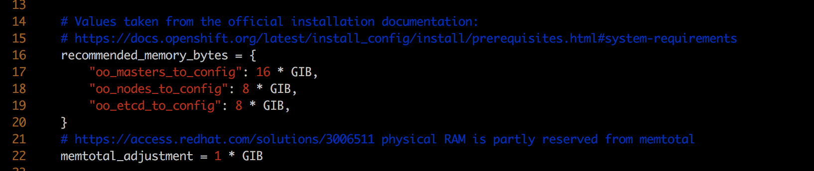

# 离线安装OpenShift 3.10

## 目标
离线安装openshift 3.10 

## 安装环境

主机信息如下

主机 | 配置 | os | 备注
--- | --- | ---  | --- 
yum.ocp.com | 2C + 4G + 200G | RHEL7.5 | 安装节点
registry.ocp.com | 1C + 2G + 300G | RHEL7.5 | registry 
master1.ocp.com | 2C + 4G + 200G | RHEL7.5 | 
master2.ocp.com | 2C + 4G + 200G | RHEL7.5
master3.ocp.com | 2C + 4G + 200G | RHEL7.5
node1.ocp.com | 2C + 4G + 200G | RHEL7.5
node2.ocp.com | 2C + 4G + 200G | RHEL7.5
node3.ocp.com | 2C + 4G + 200G | RHEL7.5
infra1.ocp.com | 1C + 2G + 200G | RHEL7.5
infra2.ocp.com | 1C + 2G + 200G | RHEL7.5


## 安装准备

## yum.ocp.com 
### 下载yum文件

```
subscription-manager register
subscription-manager refresh
subscription-manager list --available --matches '*OpenShift*'
subscription-manager attach --pool=<pool_id>
subscription-manager repos --disable="*"

subscription-manager repos \
    --enable="rhel-7-server-rpms" \
    --enable="rhel-7-server-extras-rpms" \
    --enable="rhel-7-server-ansible-2.4-rpms" \
    --enable="rhel-7-server-ose-3.10-rpms"

# install required packages
sudo yum -y install yum-utils createrepo docker git

# 下载yum文件
for repo in \
rhel-7-server-rpms \
rhel-7-server-extras-rpms \
rhel-7-server-ansible-2.4-rpms \
rhel-7-server-ose-3.10-rpms
do
  reposync --gpgcheck -lm --repoid=${repo} --download_path=</path/to/repos> 
  createrepo -v </path/to/repos/>${repo} -o </path/to/repos/>${repo} 
done
```

### 配置yum


## All nodes 

### 配置hosts文件

```
echo "192.168.3.3 master1.ocp.com" >> /etc/hosts; 
echo "192.168.3.4 master2.ocp.com" >> /etc/hosts; 
echo "192.168.3.5 master3.ocp.com" >> /etc/hosts;  
echo "192.168.3.8 node1.ocp.com" >> /etc/hosts; 
echo "192.168.3.9 node2.ocp.com" >> /etc/hosts; 
echo "192.168.3.10 node3.ocp.com" >> /etc/hosts; 
echo "192.168.3.11 infra1.ocp.com" >> /etc/hosts; 
echo "192.168.3.12 infra2.ocp.com" >> /etc/hosts; 
echo "192.168.3.14 registry.ocp.com" >> /etc/hosts; 
echo "192.168.3.15 yum.ocp.com " >> /etc/hosts; 
```

## registry.ocp.com 

说明：openshift 镜像更新很快，我在安装的时候tag是 ***v3.10.34***，现在我在记录这个安装过程的时候已经变成了 ***3.10.45***, 请直接到[官网](https://docs.openshift.com/container-platform/3.10/install/disconnected_install.html)上查找最新的tag
 
```
# download openshift component images 
docker pull registry.access.redhat.com/openshift3/csi-attacher:v3.10.34
docker pull registry.access.redhat.com/openshift3/csi-driver-registrar:v3.10.34
docker pull registry.access.redhat.com/openshift3/csi-livenessprobe:v3.10.34
docker pull registry.access.redhat.com/openshift3/csi-provisioner:v3.10.34
docker pull registry.access.redhat.com/openshift3/efs-provisioner:v3.10.34
docker pull registry.access.redhat.com/openshift3/image-inspector:v3.10.34
docker pull registry.access.redhat.com/openshift3/local-storage-provisioner:v3.10.34
docker pull registry.access.redhat.com/openshift3/manila-provisioner:v3.10.34
docker pull registry.access.redhat.com/openshift3/ose-ansible:v3.10.34
docker pull registry.access.redhat.com/openshift3/ose-cli:v3.10.34
docker pull registry.access.redhat.com/openshift3/ose-cluster-capacity:v3.10.34
docker pull registry.access.redhat.com/openshift3/ose-deployer:v3.10.34
docker pull registry.access.redhat.com/openshift3/ose-descheduler:v3.10.34
docker pull registry.access.redhat.com/openshift3/ose-docker-builder:v3.10.34
docker pull registry.access.redhat.com/openshift3/ose-docker-registry:v3.10.34
docker pull registry.access.redhat.com/openshift3/ose-egress-dns-proxy:v3.10.34
docker pull registry.access.redhat.com/openshift3/ose-egress-http-proxy:v3.10.34
docker pull registry.access.redhat.com/openshift3/ose-egress-router:v3.10.34
docker pull registry.access.redhat.com/openshift3/ose-f5-router:v3.10.34
docker pull registry.access.redhat.com/openshift3/ose-haproxy-router:v3.10.34
docker pull registry.access.redhat.com/openshift3/ose-hyperkube:v3.10.34
docker pull registry.access.redhat.com/openshift3/ose-hypershift:v3.10.34
docker pull registry.access.redhat.com/openshift3/ose-keepalived-ipfailover:v3.10.34
docker pull registry.access.redhat.com/openshift3/ose-pod:v3.10.34
docker pull registry.access.redhat.com/openshift3/ose-node-problem-detector:v3.10.34
docker pull registry.access.redhat.com/openshift3/ose-recycler:v3.10.34
docker pull registry.access.redhat.com/openshift3/ose-web-console:v3.10.34
docker pull registry.access.redhat.com/openshift3/ose-node:v3.10.34
docker pull registry.access.redhat.com/openshift3/ose-control-plane:v3.10.34
docker pull registry.access.redhat.com/openshift3/registry-console:v3.10.34
docker pull registry.access.redhat.com/openshift3/snapshot-controller:v3.10.34
docker pull registry.access.redhat.com/openshift3/snapshot-provisioner:v3.10.34
docker pull registry.access.redhat.com/rhel7/etcd

# download logging and metrics component images 
docker pull registry.access.redhat.com/openshift3/logging-auth-proxy:v3.10.34
docker pull registry.access.redhat.com/openshift3/logging-curator:v3.10.34
docker pull registry.access.redhat.com/openshift3/logging-elasticsearch:v3.10.34
docker pull registry.access.redhat.com/openshift3/logging-eventrouter:v3.10.34
docker pull registry.access.redhat.com/openshift3/logging-fluentd:v3.10.34
docker pull registry.access.redhat.com/openshift3/logging-kibana:v3.10.34
docker pull registry.access.redhat.com/openshift3/oauth-proxy:v3.10.34
docker pull registry.access.redhat.com/openshift3/metrics-cassandra:v3.10.34
docker pull registry.access.redhat.com/openshift3/metrics-hawkular-metrics:v3.10.34
docker pull registry.access.redhat.com/openshift3/metrics-hawkular-openshift-agent:v3.10.34
docker pull registry.access.redhat.com/openshift3/metrics-heapster:v3.10.34
docker pull registry.access.redhat.com/openshift3/metrics-schema-installer:v3.10.34
docker pull registry.access.redhat.com/openshift3/prometheus:v3.10.34
docker pull registry.access.redhat.com/openshift3/prometheus-alert-buffer:v3.10.34
docker pull registry.access.redhat.com/openshift3/prometheus-alertmanager:v3.10.34
docker pull registry.access.redhat.com/openshift3/prometheus-node-exporter:v3.10.34
docker pull registry.access.redhat.com/cloudforms46/cfme-openshift-postgresql
docker pull registry.access.redhat.com/cloudforms46/cfme-openshift-memcached
docker pull registry.access.redhat.com/cloudforms46/cfme-openshift-app-ui
docker pull registry.access.redhat.com/cloudforms46/cfme-openshift-app
docker pull registry.access.redhat.com/cloudforms46/cfme-openshift-embedded-ansible
docker pull registry.access.redhat.com/cloudforms46/cfme-openshift-httpd
docker pull registry.access.redhat.com/cloudforms46/cfme-httpd-configmap-generator
docker pull registry.access.redhat.com/rhgs3/rhgs-server-rhel7
docker pull registry.access.redhat.com/rhgs3/rhgs-volmanager-rhel7
docker pull registry.access.redhat.com/rhgs3/rhgs-gluster-block-prov-rhel7
docker pull registry.access.redhat.com/rhgs3/rhgs-s3-server-rhel7

# service catalog, openshift ansible broker, template service broker 
docker pull registry.access.redhat.com/openshift3/apb-base:v3.10.34
docker pull registry.access.redhat.com/openshift3/apb-tools:v3.10.34
docker pull registry.access.redhat.com/openshift3/ose-service-catalog:v3.10.34
docker pull registry.access.redhat.com/openshift3/ose-ansible-service-broker:v3.10.34
docker pull registry.access.redhat.com/openshift3/mariadb-apb:v3.10.34
docker pull registry.access.redhat.com/openshift3/mediawiki-apb:v3.10.34
docker pull registry.access.redhat.com/openshift3/mysql-apb:v3.10.34
docker pull registry.access.redhat.com/openshift3/ose-template-service-broker:v3.10.34
docker pull registry.access.redhat.com/openshift3/postgresql-apb:v3.10.34

# 
docker pull registry.access.redhat.com/jboss-amq-6/amq63-openshift
docker pull registry.access.redhat.com/jboss-datagrid-7/datagrid71-openshift
docker pull registry.access.redhat.com/jboss-datagrid-7/datagrid71-client-openshift
docker pull registry.access.redhat.com/jboss-datavirt-6/datavirt63-openshift
docker pull registry.access.redhat.com/jboss-datavirt-6/datavirt63-driver-openshift
docker pull registry.access.redhat.com/jboss-decisionserver-6/decisionserver64-openshift
docker pull registry.access.redhat.com/jboss-processserver-6/processserver64-openshift
docker pull registry.access.redhat.com/jboss-eap-6/eap64-openshift
docker pull registry.access.redhat.com/jboss-eap-7/eap70-openshift
docker pull registry.access.redhat.com/jboss-webserver-3/webserver31-tomcat7-openshift
docker pull registry.access.redhat.com/jboss-webserver-3/webserver31-tomcat8-openshift
docker pull registry.access.redhat.com/openshift3/jenkins-1-rhel7
docker pull registry.access.redhat.com/openshift3/jenkins-2-rhel7
docker pull registry.access.redhat.com/openshift3/jenkins-agent-maven-35-rhel7:v3.10.34
docker pull registry.access.redhat.com/openshift3/jenkins-agent-nodejs-8-rhel7:v3.10.34
docker pull registry.access.redhat.com/openshift3/jenkins-slave-base-rhel7
docker pull registry.access.redhat.com/openshift3/jenkins-slave-maven-rhel7
docker pull registry.access.redhat.com/openshift3/jenkins-slave-nodejs-rhel7
docker pull registry.access.redhat.com/rhscl/mongodb-32-rhel7
docker pull registry.access.redhat.com/rhscl/mysql-57-rhel7
docker pull registry.access.redhat.com/rhscl/perl-524-rhel7
docker pull registry.access.redhat.com/rhscl/php-56-rhel7
docker pull registry.access.redhat.com/rhscl/postgresql-95-rhel7
docker pull registry.access.redhat.com/rhscl/python-35-rhel7
docker pull registry.access.redhat.com/redhat-sso-7/sso70-openshift
docker pull registry.access.redhat.com/rhscl/ruby-24-rhel7
docker pull registry.access.redhat.com/redhat-openjdk-18/openjdk18-openshift
docker pull registry.access.redhat.com/redhat-sso-7/sso71-openshift
docker pull registry.access.redhat.com/rhscl/nodejs-6-rhel7
docker pull registry.access.redhat.com/rhscl/mariadb-101-rhel7

docker pull \
registry.access.redhat.com/jboss-webserver-3/webserver30-tomcat7-openshift:latest
docker pull \
registry.access.redhat.com/jboss-webserver-3/webserver30-tomcat7-openshift:1.1
```

### 配置registry

```
yum -y install docker-distribution;

mkdir /etc/crts/ && cd /etc/crts
openssl req \
   -newkey rsa:2048 -nodes -keyout ocp.com.key \
   -x509 -days 3650 -out ocp.com.crt -subj \
   "/C=CN/ST=GD/L=SZ/O=Global Security/OU=IT Department/CN=*.ocp.com"

vi /etc/docker-distribution/registry/config.yml
-----------------------------------------------
http:
   addr: :443
   tls:
       certificate: /etc/crts/ocp.com.crt
       key: /etc/crts/ocp.com.key
-----------------------------------------------

systemctl daemon-reload
systemctl enable docker-distribution;
systemctl start docker-distribution;
netstat -ntlp  | grep registry
```

### push 镜像到registry

```
docker images |egrep "redhat.com|docker.io"|awk '{print "docker tag "$3" "$1":"$2}'| \
sed -e s/access.redhat.com/ocp.com/| \
sed -e s/docker.io/registry.ocp.com/| \
xargs -i bash -c "{}"

docker images |grep "ocp.com"| \
awk '{print "docker push "$1":"$2}'| \
xargs -i bash -c "{}"

docker images |egrep "redhat.com|docker.io"| awk '{print "docker rmi "$1":"$2}'| \
xargs -i bash -c "{}"
```

### 创建本地yum源
**在yum.ocp.com节点上执行以下命令**

```
sudo yum install httpd 

cp -a /path/to/repos /var/www/html/
chmod -R +r /var/www/html/repos
restorecon -vR /var/www/html

sudo firewall-cmd --permanent --add-service=http
sudo firewall-cmd --reload

systemctl enable httpd
systemctl start httpd

```

### 安装openshift-ansible 
```
yum install openshift-ansible
```

### 配置主机互信
**在yum.ocp.com节点上执行以下命令,在安装节点和其他节点之间建立互信**

```
ssh-keygen;

for i in  master1.ocp.com master2.ocp.com master3.ocp.com node1.ocp.com node2.ocp.com node3.ocp.com infra1.ocp.com infra2.ocp.com;
do
  ssh-copy-id $i;
done;

``` 


## 安装

### 配置ansible inventory 文件
```
cat > /etc/ansible/hosts <<EOF
[OSEv3:children]
masters
nodes
etcd

# Set variables common for all OSEv3 hosts
[OSEv3:vars]
ansible_ssh_user=root
openshift_deployment_type=openshift-enterprise
oreg_url=registry.access.redhat.com/openshift3/ose-${component}:${version}
openshift_examples_modify_imagestreams=true

# uncomment the following to enable htpasswd authentication; defaults to DenyAllPasswordIdentityProvider
#openshift_master_identity_providers=[{'name': 'htpasswd_auth', 'login': 'true', 'challenge': 'true', 'kind': 'HTPasswdPasswordIdentityProvider'}]

# Native high availability cluster method with optional load balancer.
# If no lb group is defined installer assumes that a load balancer has
# been preconfigured. For installation the value of
# openshift_master_cluster_hostname must resolve to the load balancer
# or to one or all of the masters defined in the inventory if no load
# balancer is present.
openshift_master_cluster_method=native
openshift_master_cluster_hostname=openshift-internal.ocp.com
openshift_master_cluster_public_hostname=openshift-cluster.ocp.com

# host group for masters
[masters]
master1.ocp.com
master2.ocp.com
master3.ocp.com

# host group for etcd
[etcd]
master1.ocp.com
master2.ocp.com
master3.ocp.com

# Specify load balancer host
#[lb]
#lb.example.com

# host group for nodes, includes region info
[nodes]
master[1:3].ocp.com openshift_node_group_name='node-config-master'
node1.ocp.com openshift_node_group_name='node-config-compute'
node2.ocp.com openshift_node_group_name='node-config-compute'
node3.ocp.com openshift_node_group_name='node-config-compute'
infra1.ocp.com openshift_node_group_name='node-config-infra'
infra2.ocp.com openshift_node_group_name='node-config-infra'
EOF
```

### 修改配置文件

```
vim /usr/share/ansible/openshift-ansible/playbooks/openshift-checks/private/roles/openshift_health_checker/openshift_checks/memory_availability.py

```

openshift在安装的时候会检查默认配置，如果不满足则会安装失败，在这里我修改配置为

```
oo_master_to_config: 4G
oo_nodes_to_config: 4G
oo_etc_to_config: 4G
```

### 安装
```
# 检查
ansible-playbook /usr/share/ansible/openshift-ansible/playbooks/prerequisites.yml

# 安装
ansible-playbook /usr/share/ansible/openshift-ansible/playbooks/deploy_cluster.yml

```


